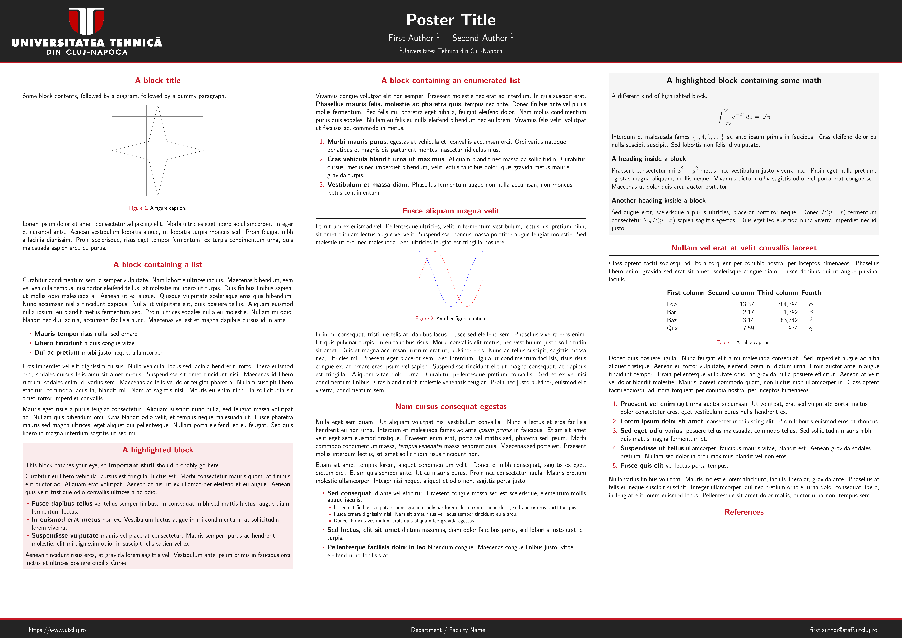
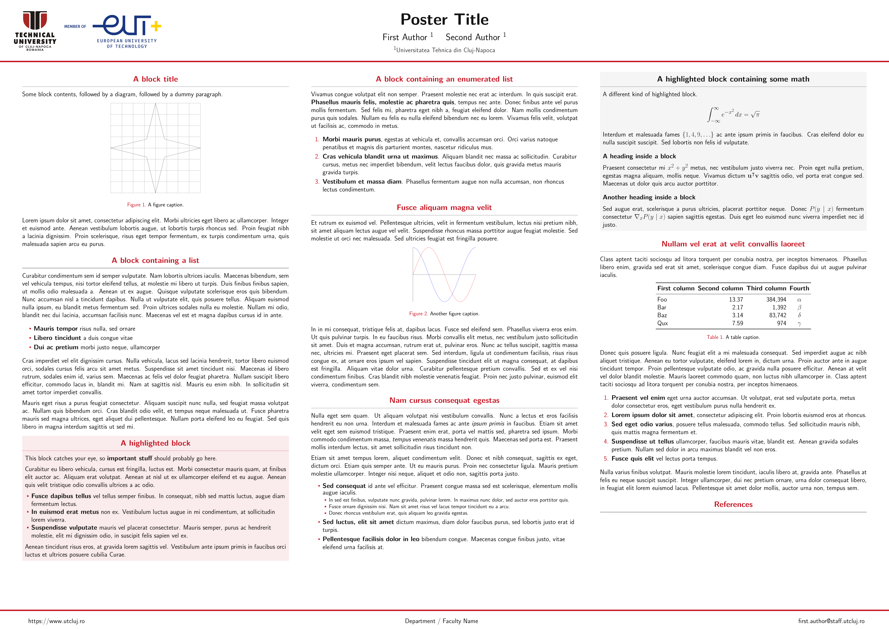

# Gemini UTCN

[](https://github.com/Marcu-Petric/poster_gemini_utcn/actions/workflows/ci.yml)

A UTCN/TUCN-flavored fork of [Gemini](https://github.com/anishathalye/gemini), the LaTeX beamerposter theme used and adapted by many universities.

This fork keeps the original Gemini structure and adds ready-to-use branding for the Technical University of Cluj-Napoca. It is meant to be a practical starting point for UTCN students, labs, and research groups who want a clean poster template without rebuilding the theme from scratch.

## Themes

### `utcn`

Dark header theme using the UTCN red/black palette.



### `utcnlight`

Light header theme for logos that work best on white backgrounds.



The UTCN theme files live in `colorthemes/`:

- `beamercolorthemeutcn.sty`
- `beamercolorthemeutcnlight.sty`

## Overleaf (download, no git clone)

Each [GitHub Release](https://github.com/Marcu-Petric/poster_gemini_utcn/releases) includes **overleaf-template.zip**: a small bundle you can upload straight to Overleaf.

1. Download `overleaf-template.zip` from the latest release.
2. Overleaf: **New Project** → **Upload Project**.
3. **Menu** → **Compiler** → **LuaLaTeX**, then **Recompile**.

Details are inside the ZIP as `README.md`. To rebuild the ZIP locally, run `bash scripts/package-overleaf.sh` or `pwsh scripts/package-overleaf.ps1`.

Releases are created when you push a version tag, for example:

```bash
git tag v1.0.0
git push origin v1.0.0
```

## Usage

Edit `poster.tex` and choose a color theme:

```tex
\usecolortheme{utcn}
```

or:

```tex
\usecolortheme{utcnlight}
```

Add a logo if you want one in the header:

```tex
\logoleft{\includegraphics[height=6.0cm]{assets/logos/UTCN-DbFHkV7H.png}}
```

Build the poster with:

```bash
latexmk -pdflatex="lualatex -interaction nonstopmode" -pdf poster.tex
```

You can also compile directly with LuaLaTeX:

```bash
lualatex -interaction=nonstopmode poster.tex
```

## Requirements

- A TeX distribution with LuaLaTeX, such as MiKTeX or TeX Live
- `latexmk` for the default build workflow
- Perl if your TeX distribution requires it for `latexmk`

## Customizing

Gemini themes are simple `.sty` files. To make another UTCN variant, copy one of the existing UTCN themes from `colorthemes/`, rename it, and adjust the colors.

For example:

```tex
\usecolortheme{myutcnvariant}
```

Contributions with new UTCN layouts, color variants, or cleaner logo setups are welcome.

## Upstream

This repository is based on [anishathalye/gemini](https://github.com/anishathalye/gemini). The original project is licensed under MIT and provides the base poster system used here.

## License

Released under the MIT License. See `LICENSE.md`.
